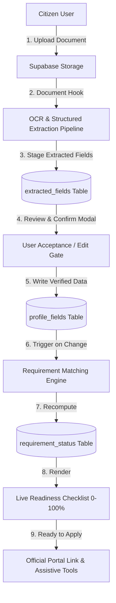
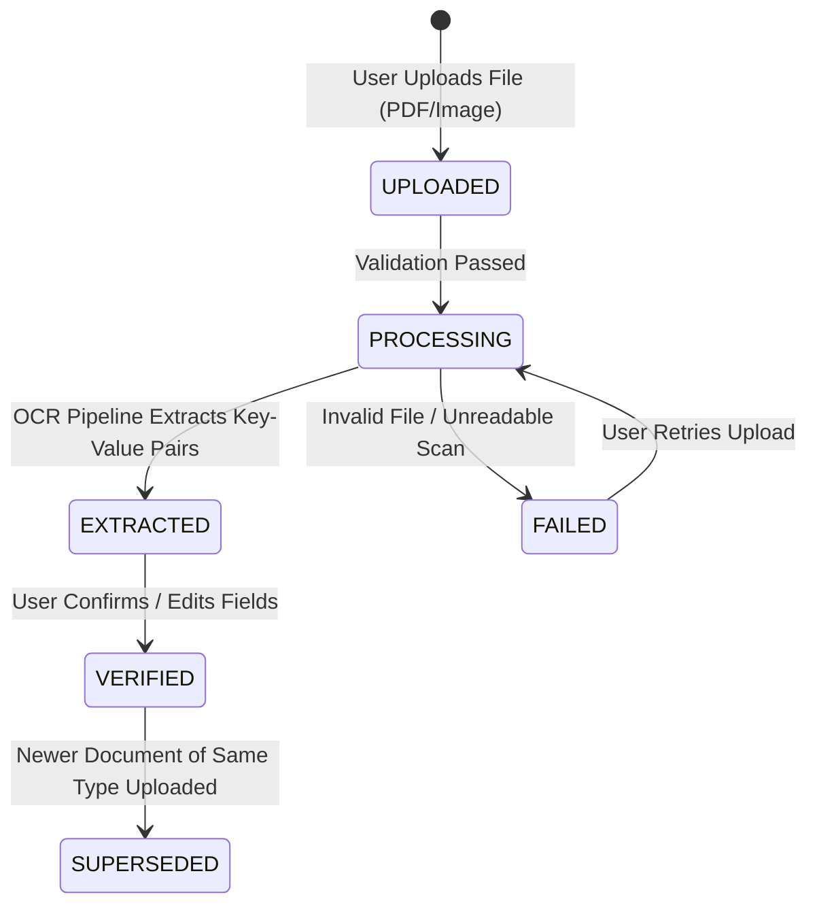

# Formly (Seva Saarthi) — Architecture & System Design

This document details the architectural design, state machines, data integrity models, and security principles governing **Formly**.

---

## 🏛️ System Overview

Formly is designed as a **Citizen Document Vault and Service Preparation Platform**. It operates on the principle of **strict human-in-the-loop verification**: the system aids the user in organizing, OCR-processing, and matching requirements against official government programs, but never writes unverified AI data silently into citizen profiles or submits applications autonomously without human approval.

---

## 🔒 Security & Data Isolation Architecture

### 1. Row-Level Security (RLS)
All database tables enforce PostgreSQL Row-Level Security:
- `profile_fields`: `auth.uid() = user_id`
- `documents`: `auth.uid() = user_id`
- `extracted_fields`: Access restricted to documents owned by `auth.uid()`
- `requirement_status`: `auth.uid() = user_id`
- `services` & `service_requirements`: Public read-only for active schemes

### 2. Idempotent Recompute Engine
The requirement matching engine (`recompute_requirement_status`) executes atomically and obeys strict constraints:
- **Locked Overrides**: Requirements marked `MANUALLY_RESOLVED` have `locked = true` and are **never** silently overwritten by automated recomputation.
- **Dynamic Invalidation**: If supporting documents or verified profile fields are deleted or unverified, unlocked requirements revert cleanly from `SATISFIED` to `MISSING`.
- **Zero Cross-User Leakage**: All RPC functions derive the user ID strictly from `auth.uid()` or validated session tokens.

---

## 📄 Document Lifecycle State Machine

---

## 🧩 Extension & Browser Assistance Layer

For interacting with official external government portals (`scholarships.gov.in`, `onlineservices.proteantech.in`), Formly provides:
1. **In-App Portal Simulation**: High-fidelity live typing simulation for testing and accessibility demonstration.
2. **Desktop Chrome Automator (Playwright)**: Spawns a real headed browser window on the user's desktop with floating Formly HUD and human-in-the-loop submission prompt.
3. **Chrome Extension (Manifest V3)**: Injects an assistive sidecar into official government portals to populate verified fields on-demand.
