<div align="center">

# 🏛️ SevaSaarthi & Sarkar Seva
### *An AI-assisted government service interoperability and citizen application platform*

[](https://nextjs.org/)
[](https://www.typescriptlang.org/)
[](https://tailwindcss.com/)
[](https://electric-sql.com/docs/reference/pglite)
[](https://www.meity.gov.in/)
[](docs/PHASE_9_1_FINAL_PRE_DEPLOYMENT_AUDIT.md)
[](LICENSE)

<p align="center">
  <b>SevaSaarthi & Sarkar Seva</b> is an authoritative, dual-platform digital governance infrastructure bridging citizen service discovery with government case operations.<br/>
  Featuring <b>strict dual-origin isolation (Port 3000 & Port 3001)</b>, an <b>advisory AI Workflow Router (Model 1)</b>, an <b>evidentiary Multilingual Entity Resolution Engine (Model 2 V4.2)</b>,<br/>
  an <b>authoritative 12-stage state machine</b>, <b>verifiable DPDP Act 2023 consent capture</b>, and <b>cryptographic SHA-256 tamper-evident audit trails</b>.
</p>

[Platform Overview](#-platform-overview) •
[System Architecture](#-system-architecture) •
[Dual-Platform Port Boundaries](#-dual-platform-origin-isolation) •
[AI Models & Governance](#-ai-systems--statutory-governance) •
[Orchestration State Machine](#-12-stage-orchestration-state-machine) •
[DPDP Act Compliance & Security](#-dpdp-act-2023-consent--cryptographic-audit) •
[Demo Credentials](#-demo-accounts--test-credentials) •
[Quick Start](#-quick-start) •
[Verification & Audit Suite](#-test--forensic-audit-suite)

</div>

---

## 📖 Platform Overview

Modern public administration faces structural bottlenecks: siloed departmental databases, duplicate paperwork across central and state schemes, transliteration mismatches across Indic languages, manual triage overhead, and the absence of a unified, consent-gated identity verification pipeline.

**SevaSaarthi & Sarkar Seva** resolves these challenges by providing two dedicated platforms sharing a unified, secure interoperability layer:

1. **SevaSaarthi (Citizen Platform — `http://localhost:3000`)**:
   - Natural language and conversational multilingual scheme discovery across 22+ official Indian languages.
   - Intelligent intent classification with out-of-distribution (OOD) routing guards.
   - Dynamic smart application forms with real-time field validation.
   - Encrypted personal document vault with OCR provenance badges and DigiLocker integration.
   - Granular, immutable Section 6 DPDP Act 2023 consent capture.
   - Real-time application tracking with transparent milestone progression.

2. **Sarkar Seva (Government Operations Platform — `http://localhost:3001`)**:
   - Priority-ranked officer work queues with SLA countdown gauges and desk management.
   - Consolidated Officer Case Workspace with unified cross-registry identity profiles.
   - AI-generated evidentiary case briefs highlighting discrepancies, match confidences, and document provenance.
   - Explicit demographic collision guards preventing mistaken identity across high-frequency names.
   - Authoritative human-in-the-loop decision console (Approve, Return for Correction, Reject).
   - Real-time Interoperability Hub, Semantic Data Mapper, and tamper-evident SHA-256 audit center.

---

## 🏛️ System Architecture

```mermaid
flowchart TD
    Citizen["Citizen / User"] --> SevaSaarthi["SevaSaarthi (Port 3000)"]
    SevaSaarthi --> Discovery["Natural Language Service Discovery"]
    Discovery --> Model1["AI Model 1: Workflow Router (Advisory)"]
    Model1 --> ControlledRegistry["Controlled Scheme / Service Registry"]
    ControlledRegistry --> DynamicApp["Dynamic Smart Application Form"]
    DynamicApp --> Consent["DPDP Act 2023 Explicit Consent Capture"]
    Consent --> Submission["Cryptographic Submission & Hashing"]
    Submission --> SarkarSeva["Sarkar Seva (Port 3001)"]
    SarkarSeva --> WorkQueue["Priority Operations Queue"]
    WorkQueue --> Model2["AI Model 2 V4.2: Multilingual Entity Resolution"]
    Model2 --> AuthorizedRegistries["Authorized Government Registries (UIDAI, CBDT, Land, Edu, Health)"]
    AuthorizedRegistries --> IdentityConsolidation["Identity Consolidation & Fuzzy Match"]
    IdentityConsolidation --> CollisionGuard["Demographic Collision & Anti-Hallucination Guard"]
    CollisionGuard --> Evidence["Structured Evidentiary Case Brief"]
    Evidence --> OfficerDecision["Authorized Human Officer Decision Console"]
    OfficerDecision --> StateMachine["Authoritative 12-Stage State Machine Engine"]
    StateMachine --> Fulfillment["Statutory Fulfillment, Delivery & SHA-256 Audit Trail"]
```



---

## 🔒 Dual-Platform Origin Isolation

To satisfy statutory cybersecurity standards and eliminate cross-context session contamination, the system enforces **physical origin and port separation**:

| Feature / Attribute | SevaSaarthi (Citizen Platform) | Sarkar Seva (Government Platform) |
| :--- | :--- | :--- |
| **Origin & Port** | `http://localhost:3000` | `http://localhost:3001` |
| **Session Cookie** | `FORMLY_CITIZEN_SESSION` | `FORMLY_GOV_SESSION` |
| **Allowed Route Scope** | `/dashboard`, `/services`, `/apply/*`, `/documents`, `/applications/*`, `/profile` | `/queue`, `/workspace/*`, `/data-mapper`, `/audit`, `/desk`, `/settings` |
| **Forbidden Route Scope** | `/queue`, `/workspace/*`, `/data-mapper`, `/audit` (Returns `403 Forbidden`) | `/dashboard`, `/services`, `/apply/*`, `/documents` (Returns `403 Forbidden`) |
| **Proxy Architecture** | Direct Next.js Server (`3000`) | Dedicated Origin Proxy (`scripts/gov-proxy.mjs` on `3001`) |
| **RBAC Authority** | Citizen authenticated persona | Department Officer, Department Admin, System Admin |

*Architectural Principle: No shared client-side persona toggle. Access permissions are resolved strictly server-side from cryptographic credentials and database RBAC records.*

---

## 🤖 AI Systems & Statutory Governance

### 1. AI Model 1: Workflow Router & Scheme Classifier
- **Implementation**: [`src/lib/server/ai/workflow-router.ts`](src/lib/server/ai/workflow-router.ts) | Pre-computed Model: [`data/ai/workflow-router/model-v2.json`](data/ai/workflow-router/model-v2.json).
- **Architecture**: Calibrated TF-IDF vectorizer with Indic token normalization, domain-anchor corroboration, and confidence scoring.
- **Safety Safeguards**: High confidence thresholds (>0.60) required for direct workflow suggestions. Low confidence or ambiguous queries automatically route to safe conversational fallback or general catalog search.
- **Authority Level**: **Strictly Advisory**. The citizen retains complete discretion to select and apply for any public service regardless of router suggestions.

### 2. AI Model 2 V4.2: Multilingual Entity Resolution Engine
- **Implementation**: [`src/lib/server/ai/entity-resolution/v4-transformer/v4-engine.ts`](src/lib/server/ai/entity-resolution/v4-transformer/v4-engine.ts)
- **Architecture**:
  - `intfloat/multilingual-e5-base` 768-dimensional transformer embeddings for cross-lingual name/address representation.
  - Multi-tiered candidate blocking (Soundex, Metaphone, Pincode/District indexing).
  - Deterministic field similarity scoring (Jaro-Winkler, Levenshtein, Verhoeff checksums, Date-of-Birth tolerance).
  - Cross-registry identity consolidation across UIDAI (Aadhaar), CBDT (PAN), Land Records, Health (ABHA), and Education (DigiLocker).
- **Anti-Hallucination & Collision Guard**:
  - Demographic collision detector flags cases sharing common names (e.g., *Ramesh Kumar*, *Priya Sharma*) but differing in DOB, father/guardian name, or Pincode.
  - Ambiguous cases are highlighted with visual warning tags in the officer console.
- **Fallback Architecture**: V4.2 automatically falls back to deterministic V3.1 scoring if transformer inference is unavailable or throttled.

### 3. Absolute Human-in-the-Loop Governance (Product Rule 1)
```
┌────────────────────────────────────────────────────────────────────────┐
│                        STATUTORY GOVERNANCE MANDATE                    │
│                                                                        │
│   AI MODELS HAVE ZERO STATUTORY OR LEGAL DECISION-MAKING AUTHORITY.   │
│                                                                        │
│   • AI Model 1 assists citizens in finding appropriate schemes.        │
│   • AI Model 2 consolidates records and presents evidentiary briefs.   │
│   • ONLY an authenticated, authorized government officer can make an   │
│     administrative determination: APPROVED, REJECTED, or RETURNED.    │
└────────────────────────────────────────────────────────────────────────┘
```

---

## 🔄 12-Stage Orchestration State Machine

Every public service application progresses through an authoritative, unidirectional state machine:

```text
DRAFT
  ↓
SUBMITTED
  ↓
PRE-FLIGHT VALIDATION (Completeness, document integrity & checksums)
  ↓
CONSENT RECORDED (Section 6, DPDP Act 2023 token generation)
  ↓
INTEROPERABILITY HUB (UIDAI Aadhaar Gateway, DigiLocker, Revenue)
  ↓
CROSS-SYSTEM VALIDATION (Model 2 V4.2 Entity Resolution & Biographic Match)
  ↓
GOVERNMENT ROUTING (Assigned to Regional Processing Cell & Officer Desk)
  ↓
OFFICER REVIEW (Prepared evidentiary brief & decision console)
  ├── ACCEPT APPLICATION ──────────► APPROVED
  │                                    ↓
  │                                  FULFILLMENT / ISSUANCE
  │                                    ↓
  │                                  DISPATCH (India Post Speed Post / Digital)
  │                                    ↓
  │                                  DELIVERED (COMPLETED)
  │
  ├── RETURN FOR CORRECTION ───────► RETURNED_FOR_CORRECTION ──► Citizen Resubmission ──► REVALIDATE
  │
  └── REJECT APPLICATION ──────────► REJECTED (CLOSED with statutory grounds)
```

---

## 🛡️ DPDP Act 2023 Consent & Cryptographic Audit

### Privacy by Design (DPDP Act 2023 Compliance)
1. **Section 6 Purpose-Limited Consent**: Every submission captures a digital consent certificate recording the exact purpose, timestamp, citizen UUID, and allowed data registries.
2. **Strict Registry Whitelisting**: External connectors (UIDAI, CBDT, Land Records) will reject data retrieval requests unless backed by a validated, non-revoked consent token.
3. **Citizen Rights**: Citizens can inspect active consent grants, view data access logs, and request revocation directly from their profile.

### Cryptographic Audit Trail (Product Rule 19)
- Every system state change, AI recommendation, connector fetch, and officer decision writes a permanent, tamper-evident log entry.
- Each audit block contains: `Timestamp`, `Actor UUID`, `Role`, `Action`, `Previous State`, `New State`, `Payload Hash`, and `SHA-256 Chained Hash`.
- Audit logs are accessible to administrators via the Sarkar Seva Audit Center (`/audit`).

---

## 👥 Demo Accounts & Test Credentials

### 1. Citizen Persona (SevaSaarthi — Port 3000)
| Field | Value |
| :--- | :--- |
| **Portal URL** | `http://localhost:3000/login` |
| **Email** | `sankeerths615@gmail.com` |
| **Password** | `1234567890` |
| **Citizen Name** | Sai Sankeerth |
| **Seeded Cases** | `PAN-2026-0001`, `SCH-2026-0042` |

### 2. Government Officer Persona (Sarkar Seva — Port 3001)
| Field | Value |
| :--- | :--- |
| **Portal URL** | `http://localhost:3001/login` |
| **Email** | `sankeerthvss@gmail.com` |
| **Password** | `1234567890` |
| **Officer Name** | Officer Sai Sankeerth |
| **Employee Code** | `OFF-SAN-7043` |
| **Department / Scope** | Income Tax Department (CBDT) - PAN Division (Desk `OFF-PAN-7042`) |

### 3. Alternative Administrative Personas
| Role | Email | Password | Scope / Desk |
| :--- | :--- | :--- | :--- |
| **Department Admin** | `rajesh.sharma@incometax.gov.in` | `govsecure2026` | `ADM-PAN-1001` (CBDT CPC New Delhi) |
| **System Admin** | `vikram.rao@negd.gov.in` | `govsecure2026` | `SYS-ROOT-0099` (NeGD / MeitY) |

---

## 🚀 Quick Start

### Prerequisites
- **Node.js**: v18.0.0 or higher (v20+ LTS recommended)
- **npm**: v9.0.0 or higher

### 1. Installation
```bash
git clone https://github.com/chvarshith25-bit/SevaSaarthi.git
cd SevaSaarthi
npm install
```

### 2. Running Both Platforms Concurrently

```bash
# Option A: Run both platforms concurrently in one command
npm run dev:both

# Option B: Run in separate terminal windows
# Terminal 1: SevaSaarthi Citizen Portal (Port 3000)
npm run dev:citizen

# Terminal 2: Sarkar Seva Government Portal (Port 3001)
npm run dev:gov
```

### 3. Accessing the Platforms
- **Citizen Portal (SevaSaarthi)**: [http://localhost:3000](http://localhost:3000)
- **Government Operations (Sarkar Seva)**: [http://localhost:3001](http://localhost:3001)

### 4. Production Build & Execution
```bash
npm run build
npm run start:both
```

---

## 🧪 Test & Forensic Audit Suite

The codebase has undergone a full forensic pre-deployment audit with **100% passing verification** across all subsystems:

```bash
# Run static TypeScript typecheck (0 errors across 70+ routes)
npm run typecheck

# Run full automated Jest unit & integration test suite
npm test

# Run database schema integrity & migration validation
npm run test:schema

# Run strict dual-origin & port separation security test
npm run test:separation

# Run the Phase 9.1 comprehensive A-to-Z forensic audit (197 checks)
npx tsx scripts/test-full-a-to-z-audit.ts

# Run Model 2 V4.2 Transformer & Entity Resolution benchmark
npx tsx scripts/test-ai-model2-v4-transformer.mjs
```

### Verification Highlights:
- [x] **Phase 9.1 Forensic Pre-Deployment Audit**: 197 / 197 checks passed ([Audit Report](docs/PHASE_9_1_FINAL_PRE_DEPLOYMENT_AUDIT.md)).
- [x] **Live Browser Smoke Test**: 24 / 24 end-to-end user journeys verified ([Integrity Doc](docs/FINAL_RELEASE_ARTIFACT_INTEGRITY.md)).
- [x] **Model 1 Router Integrity**: Zero out-of-domain hallucinations; calibrated confidence routing.
- [x] **Model 2 V4.2 Multi-Registry Engine**: 100% precision, collision safety, and fail-closed V3.1 fallback.
- [x] **Dual-Platform Boundary**: Complete origin isolation between Port 3000 and Port 3001.
- [x] **State Machine Determinism**: Strict sequential transition enforcement across all 12 stages.
- [x] **Cryptographic Audit**: Tamper-evident SHA-256 block generation on every statutory action.

---

## 📄 License

Distributed under the **MIT License**. See [LICENSE](LICENSE) for details.
