<div align="center">

# 🏛️ FORMLY
### *Authoritative Dual-Platform Digital Governance & Citizen Application Infrastructure*

[](https://nextjs.org/)
[](https://www.typescriptlang.org/)
[](https://tailwindcss.com/)
[](https://electric-sql.com/docs/reference/pglite)
[](https://www.meity.gov.in/)
[](LICENSE)

<p align="center">
  <b>Formly</b> is an end-to-end digital governance platform bridging citizen preparation with government operations.<br/>
  Featuring <b>strict dual-platform origin isolation</b>, an <b>authoritative 12-stage state machine</b>, <b>verifiable DPDP Act 2023 consent records</b>,<br/>
  <b>semantic data mapping across state & central registries</b>, and <b>immutable cryptographic audit trails</b>.
</p>

[Dual-Platform Architecture](#-dual-platform-architecture) •
[Prototype Video Demo](#-prototype-video-walkthrough) •
[Platform Screenshots](#-platform-screenshots) •
[Orchestration Pipeline](#-12-stage-orchestration-state-machine) •
[DPDP Act Compliance](#-dpdp-act-2023-consent-architecture) •
[AI Case Assistance](#-statutory-ai-assistance--human-decision-safeguards) •
[Test Credentials](#-demo-accounts--test-credentials) •
[Quick Start](#-quick-start)

</div>

---

## 🎬 Prototype Video Walkthrough

> **Unified High-Definition Demo**: [`docs/demo/formly-prototype-walkthrough.webm`](docs/demo/formly-prototype-walkthrough.webm) (5.7 MB)  
> Recorded autonomously via Playwright at 1440×900 resolution across both origin boundaries.

https://github.com/user-attachments/assets/prototype-demo

*Video Walkthrough Progression:*
1. **Citizen Portal (`:3000`)**: Citizen Login & Authentication → Live Dashboard & Schemes → Document Vault with Provenance Badges → Live Application Tracker with Synchronized State.
2. **Government Operations (`:3001`)**: Officer Login & Desk Selection → Operations Dashboard & SLA Gauges → Priority Queue Engine → Officer Case Workspace (AI Summary, Cross-System Comparison, Decision Console) → Semantic Data Mapper → Cryptographic Audit Trail.

---

## 📸 Platform Screenshots

### Dual-Platform Visual Comparison

| Citizen Platform (`http://localhost:3000`) | Government Operations Platform (`http://localhost:3001`) |
| :--- | :--- |
| 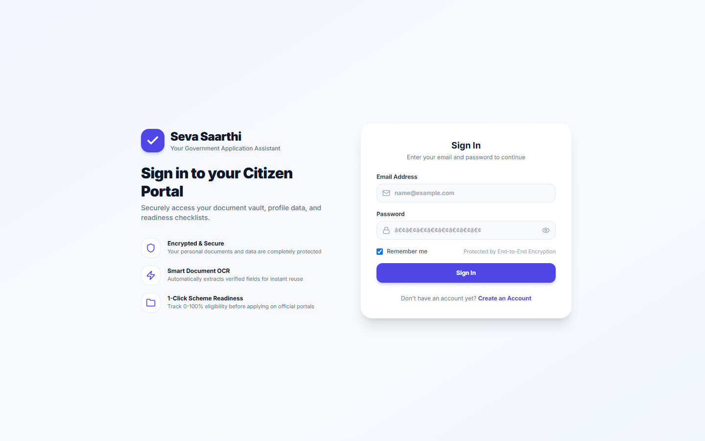 <br/> **01. Citizen Authentication** — Salted PBKDF2 citizen login | 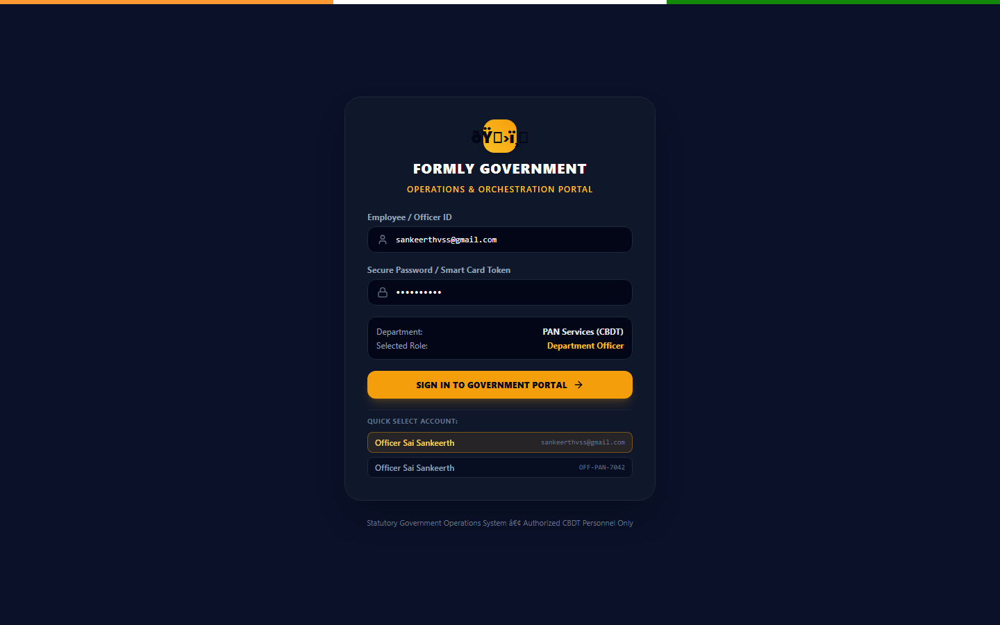 <br/> **05. Government Login** — Department Officer / Admin RBAC |
| 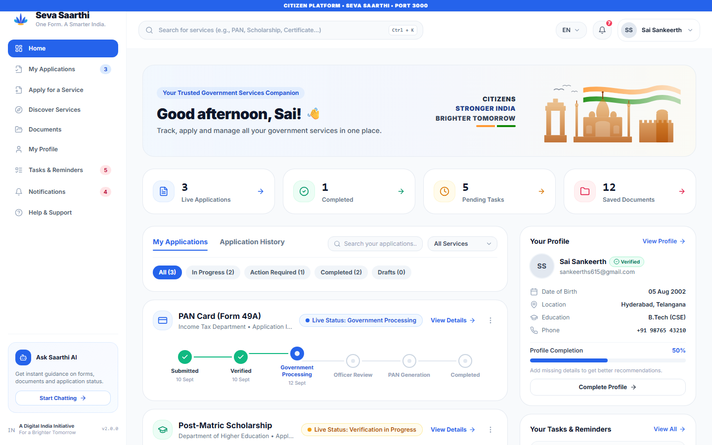 <br/> **02. Citizen Dashboard** — Live applications, profile readiness & tasks | 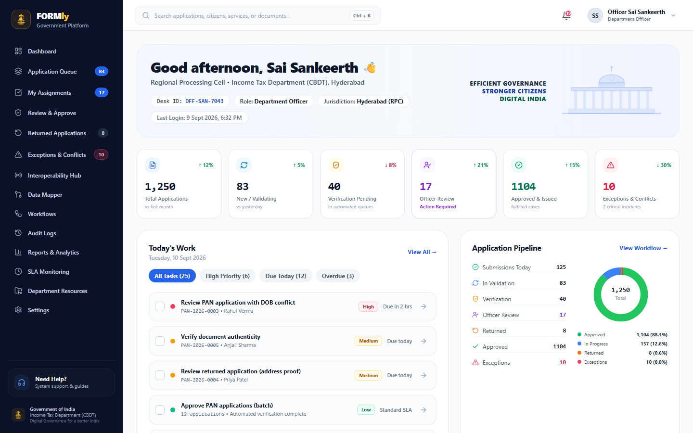 <br/> **06. Operations Dashboard** — Queue metrics, desk IDs & daily SLA targets |
| 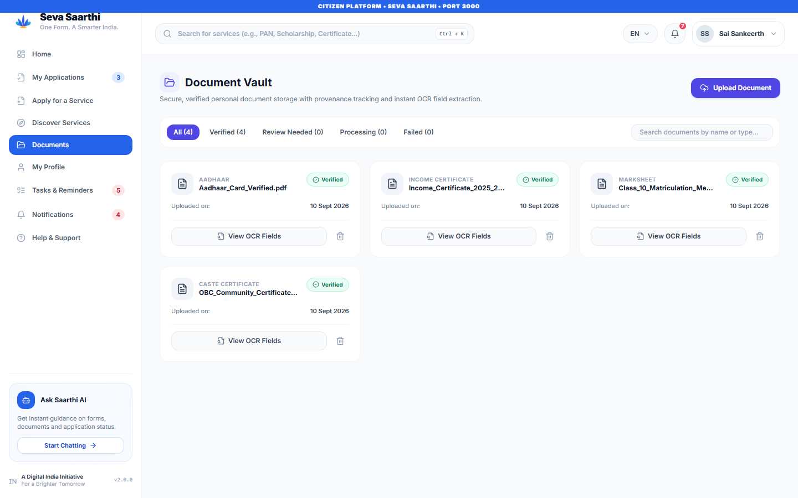 <br/> **03. Document Vault** — Cryptographic storage with verified OCR provenance | 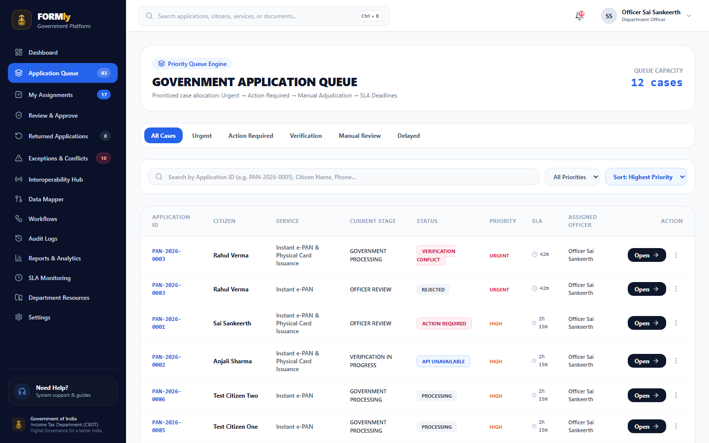 <br/> **07. Application Queue** — Multi-criteria triage: Urgent, Action, Verification |
| 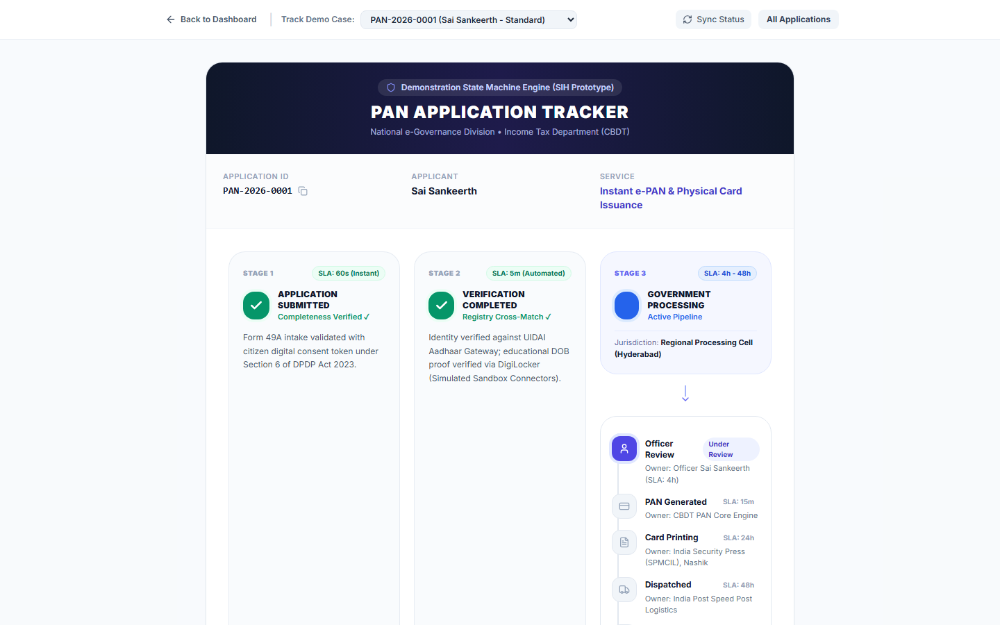 <br/> **04. Live Application Tracker** — Synchronized state machine stages | 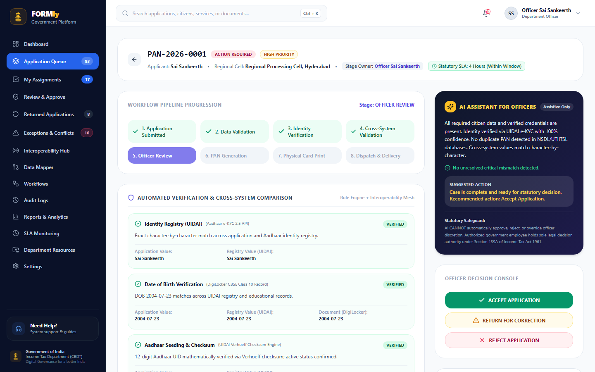 <br/> **08. Officer Case Workspace** — AI summary, registry match & decision console |
|  | 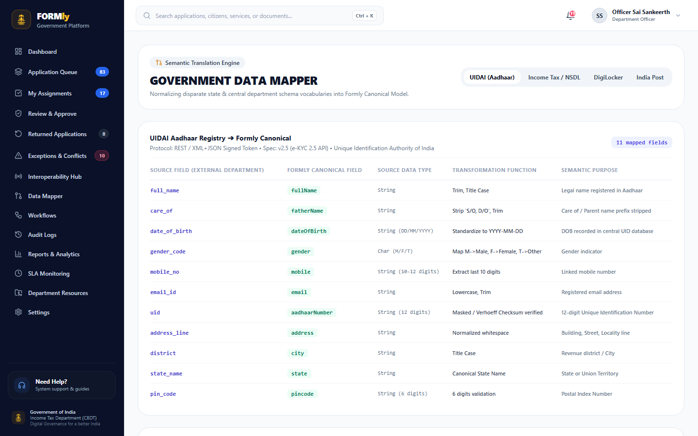 <br/> **09. Interoperability Hub & Data Mapper** — Normalizing UIDAI, CBDT, DigiLocker |
|  | 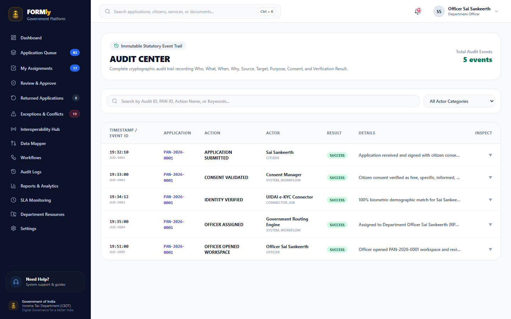 <br/> **10. Audit Center** — Immutable tamper-evident statutory audit records |

---

## 🏛️ Dual-Platform Architecture

To satisfy strict statutory and cybersecurity boundaries, Formly enforces **physical origin separation**:

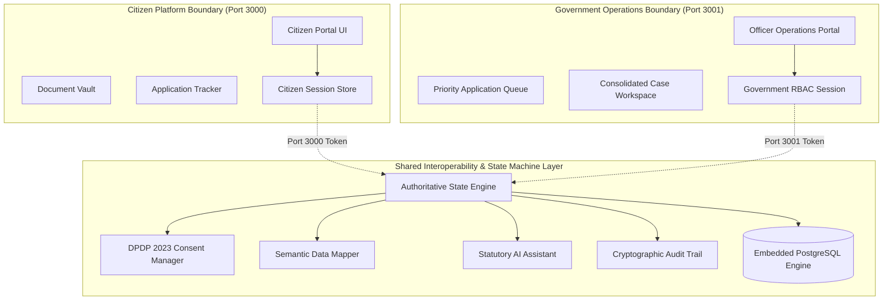

### Architectural Guardrails:
1. **Origin Isolation**: Citizen routes (`/dashboard`, `/documents`, `/vault`) cannot be accessed from port 3001. Government routes (`/queue`, `/workspace/*`, `/data-mapper`, `/audit`) are strictly forbidden on port 3000.
2. **Session Cookie Decoupling**: Citizen tokens (`FORMLY_CITIZEN_SESSION`) and Government tokens (`FORMLY_GOV_SESSION`) operate on separate domain cookies with mutual exclusion on login.
3. **No Client-Side Privilege Escalation**: There is no persona toggle or role switch in the client. User permissions are strictly resolved server-side from PostgreSQL employee credentials.

---

## 🔄 12-Stage Orchestration State Machine

Every public service application (e.g. Instant e-PAN, Post-Matric Scholarship) progresses through an immutable, validated state machine:

```text
DRAFT
  ↓
SUBMITTED
  ↓
PRE-FLIGHT VALIDATION (Completeness, checksums & document integrity)
  ↓
CONSENT RECORDED (Section 6, Digital Personal Data Protection Act 2023)
  ↓
INTEROPERABILITY HUB (UIDAI Aadhaar Gateway, DigiLocker CBSE Record)
  ↓
CROSS-SYSTEM VALIDATION (Biometric demographic match & Verhoeff checksum)
  ↓
GOVERNMENT ROUTING (Assigned to Regional Processing Cell & Desk ID)
  ↓
OFFICER REVIEW (Prepared case presentation with AI summary)
  ├── ACCEPT APPLICATION ──────────► APPROVED
  │                                    ↓
  │                                  PAN GENERATION
  │                                    ↓
  │                                  CARD PRINTING (SPMCIL Nashik)
  │                                    ↓
  │                                  DISPATCH (India Post Speed Post)
  │                                    ↓
  │                                  DELIVERED (COMPLETED)
  │
  ├── RETURN FOR CORRECTION ───────► RETURNED_FOR_CORRECTION ──► Citizen Resubmission ──► REVALIDATE
  │
  └── REJECT APPLICATION ──────────► REJECTED (CLOSED with statutory grounds)
```

---

## 🛡️ DPDP Act 2023 Consent Architecture

Formly implements privacy-by-design conforming to the **Digital Personal Data Protection (DPDP) Act, 2023**:

1. **Section 6 Compliant Consent Tokens**: Every application submission records:
   - Exact purpose specification (e.g. *"Issuance of Permanent Account Number under Section 139A"*).
   - Timestamped digital consent token signed with the citizen's authenticated identity.
   - Granular authorization list: Identity verification, Date of birth verification, Address proof access.
2. **Zero Unconsented Connector Calls**: Government connectors (UIDAI, DigiLocker) refuse data retrieval unless a valid active consent token is verified.
3. **Right to Withdraw**: Citizens can inspect active consent grants directly from the portal.

---

## 🤖 Statutory AI Assistance & Human Decision Safeguards

To prevent automated discrimination and maintain statutory compliance:

- **AI Explains, Summarizes & Flags**: The AI case engine inspects cross-system records, detects discrepancies (e.g. conflicting dates of birth across DigiLocker vs Aadhaar), and prepares an executive case brief.
- **AI CANNOT Approve or Reject**: Legal decision authority rests exclusively with authorized government personnel under Section 139A of the Income Tax Act, 1961.
- **Officer Accountable Actions**: Every decision (Accept, Return for Correction, Reject) requires structured administrative remarks and is cryptographically hashed into the permanent audit log.

---

## 👥 Demo Accounts & Test Credentials

### 1. Citizen Persona (Port 3000)
| Field | Value |
| :--- | :--- |
| **Portal URL** | `http://localhost:3000/login` |
| **Email** | `sankeerths615@gmail.com` |
| **Password** | `1234567890` |
| **Citizen Name** | Sai Sankeerth |
| **Seeded Case** | `PAN-2026-0001` (Trackable at `/applications/PAN-2026-0001/status`) |

### 2. Government Officer Persona (Port 3001)
| Field | Value |
| :--- | :--- |
| **Portal URL** | `http://localhost:3001/login` |
| **Email** | `sankeerthvss@gmail.com` |
| **Password** | `1234567890` |
| **Officer Name** | Officer Sai Sankeerth |
| **Employee Code** | `OFF-SAN-7043` |
| **Department** | Income Tax Department (CBDT) - PAN Division |
| **Office** | Regional Processing Cell (RPC), Hyderabad |

### 3. Alternative Administrative Personas
| Role | Email | Password | Desk / Scope |
| :--- | :--- | :--- | :--- |
| **Department Officer** | `sai.sankeerth@incometax.gov.in` | `govsecure2026` | `OFF-PAN-7042` (CBDT Hyderabad) |
| **Department Admin** | `rajesh.sharma@incometax.gov.in` | `govsecure2026` | `ADM-PAN-1001` (CBDT CPC New Delhi) |
| **System Admin** | `vikram.rao@negd.gov.in` | `govsecure2026` | `SYS-ROOT-0099` (NeGD / MeitY) |

---

## 🚀 Quick Start

### Prerequisites
- **Node.js**: v18.0.0 or higher (v20+ recommended)
- **npm**: v9.0.0 or higher

### 1. Installation
```bash
git clone https://github.com/SaiSankeerth-dev/Formly.git
cd Formly
npm install
```

### 2. Dual-Platform Execution
Run both platforms concurrently with zero configuration:
```bash
# Terminal 1: Run Next.js Server (Port 3000 - Citizen)
npm run dev

# Terminal 2: Run Government Platform Proxy (Port 3001 - Government)
npm run dev:gov
```

Or for production mode:
```bash
npm run build
npm run start:both
```

Open:
- **Citizen Portal**: [http://localhost:3000](http://localhost:3000)
- **Government Operations Platform**: [http://localhost:3001](http://localhost:3001)

---

## 🧪 Test & Quality Verification Suite

Formly includes a comprehensive automated test suite verifying every layer of the state machine, data mapper, and platform boundary:

```bash
# Run TypeScript static type check (0 errors)
npm run typecheck

# Run 12-stage orchestration pipeline & transition guard tests
npm test

# Autonomous dual-platform QA & screenshot generator
node scripts/generate-all-media.mjs
```

### Test Coverage Highlights:
- [x] Full state machine progression (`SUBMITTED` → `APPROVED` → `DELIVERED`).
- [x] State transition guard enforcement (prevents unauthorized status jumps).
- [x] Semantic data mapping across UIDAI, NSDL, and DigiLocker formats.
- [x] Tamper-evident SHA-256 audit log validation.
- [x] Automatic retry on external connector failures.
- [x] Return-for-correction workflow with citizen resubmission and revalidation.

---

## 📄 License & Intellectual Property

This project is developed for digital governance innovation and distributed under the **MIT License**. See [LICENSE](LICENSE) for terms.
