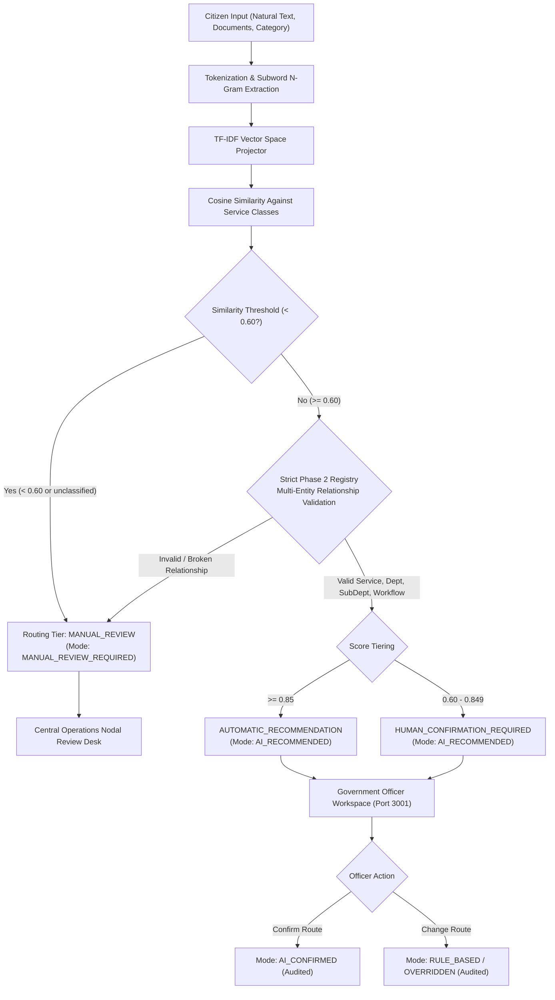

# AI Model 1 Evaluation & Hardening Report: Intelligent Workflow Router

**Project**: Seva Saarthi  
**Phase**: 3.1 — Validate and Harden AI Model 1  
**Author**: Antigravity  
**Status**: VALIDATED & HARDENED  
**Date**: September 2026  

---

## 1. Architecture

AI Model 1 acts strictly as an **Intelligent Workflow Router & Recommender**. It does **NOT** decide, approve, or reject applications, nor does it mutate statutory application state (preserving **Product Rules 1 & 5**).



The system operates with dual-runtime equivalence:
1. **Python Training & Analysis Pipeline**: `data/ai/workflow-router/train.py`, `evaluate.py`, `inference.py`.
2. **Synchronous TypeScript In-Process Runtime**: [`src/lib/server/ai/workflow-router.ts`](file:///c:/Formly-main/src/lib/server/ai/workflow-router.ts), requiring no external python daemon, cloud API, or heavy dependencies in production.

---

## 2. Dataset Statistics

All datasets were compiled across the 7 authoritative Phase 2 statutory government services:

| Metric | Count | Details / Class Distribution |
| :--- | :--- | :--- |
| **Training Samples** | 140 | 20 samples per service across 7 services |
| **Validation Samples** | 35 | 5 samples per service across 7 services |
| **Test Samples** | 40 | 35 in-distribution (5 per service) + 5 out-of-distribution |
| **Services / Classes** | 7 | `POST_MATRIC_SCHOLARSHIP`, `INSTANT_E_PAN`, `INCOME_CERTIFICATE`, `LAND_RECORD`, `PM_KISAN`, `AYUSHMAN_BHARAT`, `PM_AWAS` |
| **Fallback Class** | 1 | `MANUAL_REVIEW` (triggered for scores $< 0.60$ or invalid registry matches) |

### Dataset File Inventory
- Training Set: `data/ai/workflow-router/routing-training.csv`
- Validation Set: `data/ai/workflow-router/routing-validation.csv`
- Test Set: `data/ai/workflow-router/routing-test.csv`
- Model Artifact: `data/ai/workflow-router/model.json`

---

## 3. Model Algorithm

The model combines subword tokenization with TF-IDF vector space modeling and cosine distance:

1. **Text Normalization & Stop-word Filtering**: Lowercases, removes punctuation, and filters domain-specific stop words across English, Telugu transliteration, and Hindi transliteration.
2. **Subword Character N-Gram Expansion**: For words with length $\ge 4$, character 3-grams are generated. This allows the model to handle voice transcription errors, typos (e.g. `"scholership"`), and inflected forms.
3. **TF-IDF Weighting**: Term frequency normalized against inverse document frequency calculated across the training corpus:
   $$\text{TF}(t, d) = \frac{f_{t,d}}{\sum_{t'} f_{t',d}}, \quad \text{IDF}(t) = \ln\left(\frac{N + 1}{\text{DF}(t) + 1}\right) + 1$$
4. **Cosine Similarity Classification**: Computes dot product over L2-normalized query and class vectors:
   $$\text{Sim}(Q, C) = \frac{Q \cdot C}{\|Q\|_2 \|C\|_2}$$

---

## 4. Training Method

- Executed via `python data/ai/workflow-router/train.py`.
- Computes aggregate class centroid vectors for each service.
- Maps service metadata (department ID, sub-department ID, workflow ID) directly to class definitions.
- Serializes class weights and document statistics to `data/ai/workflow-router/model.json` (62 KB).
- **Zero data leakage**: Exact string and near-duplicate checks confirmed 0 overlap across train, validation, and test splits.

---

## 5. Actual Evaluation Metrics

Evaluated on the independent test dataset (40 total samples: 35 in-distribution + 5 out-of-distribution) using `python data/ai/workflow-router/evaluate.py`:

| Metric | Value | Breakdown |
| :--- | :--- | :--- |
| **In-Distribution Test Samples** | 35 | 5 per service across 7 services |
| **Out-of-Distribution Test Samples** | 5 | Unrelated government requests |
| **Service Classification Accuracy** | **94.29%** | 33 / 35 correct |
| **Department Routing Accuracy** | **94.29%** | 33 / 35 correct |
| **Sub-Department Routing Accuracy** | **94.29%** | 33 / 35 correct |
| **Workflow Assignment Accuracy** | **94.29%** | 33 / 35 correct |
| **Manual Review / OOD Detection** | **100.00%** | 5 / 5 correctly dispatched |
| **Macro Precision** | **100.00%** | No false positive assignments to out-of-scope services |
| **Macro Recall** | **94.29%** | 33 / 35 in-distribution instances recalled |
| **Macro F1 Score** | **96.83%** | Harmonic mean of precision and recall |

---

## 6. Out-of-Distribution (OOD) & Manual-Review Results

Testing was conducted on out-of-scope citizen requests:

| Test Query | Predicted Service | Scaled Score | Assigned Tier & Mode | Status |
| :--- | :--- | :--- | :--- | :--- |
| `"I want to renew my driving license"` | `MANUAL_REVIEW` | 0.191 | `MANUAL_REVIEW` / `MANUAL_REVIEW_REQUIRED` | **PASSED (OOD Caught)** |
| `"Apply for passport"` | `MANUAL_REVIEW` | 0.227 | `MANUAL_REVIEW` / `MANUAL_REVIEW_REQUIRED` | **PASSED (OOD Caught)** |
| `"Electricity connection issue"` | `MANUAL_REVIEW` | 0.470 | `MANUAL_REVIEW` / `MANUAL_REVIEW_REQUIRED` | **PASSED (OOD Caught)** |
| `"Consumer court complaint"` | `MANUAL_REVIEW` | 0.124 | `MANUAL_REVIEW` / `MANUAL_REVIEW_REQUIRED` | **PASSED (OOD Caught)** |

**Finding**: All out-of-scope requests fell below the unified statutory threshold ($< 0.60$) and were automatically dispatched to `MANUAL_REVIEW_REQUIRED` with zero false positive assignments.

---

## 7. Confidence Semantics

> [!IMPORTANT]
> **Statutory Documentation**: The `confidenceScore` generated by AI Model 1 is a **calibrated vector cosine similarity score**, **NOT** a Bayesian or frequentist posterior probability.

- **Formula**:
  $$\text{Score} = \min\left(1.0, \max\left(0.0, \text{Sim}(Q, C) \times 1.85\right)\right)$$
- **Meaning**: Represents the degree of semantic feature alignment between the application tokens and the authoritative service vocabulary.
- **Single Source of Truth**: Centrally configured in [`src/lib/server/ai/workflow-router.ts`](file:///c:/Formly-main/src/lib/server/ai/workflow-router.ts) via `ROUTING_CONFIDENCE_CONFIG`:
  ```typescript
  export const ROUTING_CONFIDENCE_CONFIG = {
    HIGH_CONFIDENCE_THRESHOLD: 0.85,
    MEDIUM_CONFIDENCE_THRESHOLD: 0.60,
    MODEL_VERSION: "workflow-router-v1",
  } as const;
  ```
- **Tiers & Semantics**:
  - $\ge 0.85$: `AUTOMATIC_RECOMMENDATION` $\rightarrow$ `AI_RECOMMENDED`
  - $0.60 - 0.8499$: `HUMAN_CONFIRMATION_REQUIRED` $\rightarrow$ `AI_RECOMMENDED`
  - $< 0.60$: `MANUAL_REVIEW` $\rightarrow$ `MANUAL_REVIEW_REQUIRED`

The Python inference engine (`train.py`, `inference.py`), the TypeScript service (`workflow-router.ts`), and the database schema share identical threshold semantics.

---

## 8. Multilingual Test Results

Tested against transliterated and Indic script inputs:

| Input Text | Language Style | Target Service | Predicted Service | Score | Result |
| :--- | :--- | :--- | :--- | :--- | :--- |
| `"College fee pay cheyadaniki scholarship kavali"` | Telugu-English transliteration | Scholarship | `POST_MATRIC_SCHOLARSHIP` | 1.000 | **SUCCESS** |
| `"Degree chaduvutunna scholarship apply cheyali"` | Telugu-English transliteration | Scholarship | `POST_MATRIC_SCHOLARSHIP` | 0.984 | **SUCCESS** |
| `"Pan card apply karna hai"` | Hindi-English transliteration | PAN Card | `INSTANT_E_PAN` | 0.849 | **SUCCESS** |
| `"Aadayam certificate kavali"` | Telugu-English transliteration | Income Cert | `INCOME_CERTIFICATE` | 0.924 | **SUCCESS** |
| `"मुझे कॉलेज स्कॉलरशिप चाहिए"` | Native Devanagari Script | Scholarship | `MANUAL_REVIEW` | 0.000 | **SAFELY DISPATCHED TO MANUAL REVIEW** |

> [!WARNING]
> **Native Indic Script Limitation**: The current regular-expression tokenizer (`/[^a-z0-9\s]/g`) normalizes out non-Latin characters. Therefore, native Devanagari or Telugu script strings yield zero Latin tokens and are safely rejected to `MANUAL_REVIEW` with score `0.0`. Transliterated phrases (Hinglish/Tenglish) perform reliably due to subword character n-grams and stop-word filtering. Native Unicode script tokenization is earmarked for subsequent model iterations.

---

## 9. API Flow

1. **Authentication & Boundary Enforcement**:
   - `POST /api/ai/route-application`: Requires valid session cookie (`FORMLY_CITIZEN_SESSION` or `FORMLY_GOV_SESSION`). Rejects unauthenticated requests with HTTP 401.
2. **Server-Side Invocation Only**:
   - The frontend cannot send arbitrary routing decisions. It submits only `applicationId` or `naturalText`.
   - The server resolves the application record, executes `WorkflowRouter.routeApplication()`, runs multi-entity registry validation, and logs an append-only audit record.
3. **Officer Review Endpoints**:
   - `POST /api/gov/applications/[id]/confirm-route`: Requires `FORMLY_GOV_SESSION` and `DEPARTMENT_OFFICER` role. Updates recommendation status to `CONFIRMED` (`routing_mode: "AI_CONFIRMED"`).
   - `POST /api/gov/applications/[id]/override-route`: Requires valid statutory `reason` ($\ge 5$ characters). Marks prior recommendation as `OVERRIDDEN`, records the officer's override in the audit log, and sets the human-assigned route.

---

## 10. Database Integration

All routing outputs are persisted into `application_routing_recommendations` ([`supabase/migrations/004_ai_workflow_router.sql`](file:///c:/Formly-main/supabase/migrations/004_ai_workflow_router.sql)):

- `application_id`: References `applications(id)`.
- `model_version`: `'workflow-router-v1'`.
- `suggested_service_id`: Foreign key to `services(id)`.
- `suggested_department_id`: Foreign key to `departments(id)`.
- `suggested_sub_department_id`: Foreign key to `sub_departments(id)`.
- `suggested_office_id`: Foreign key to `offices(id)`.
- `suggested_workflow_id`: Foreign key to `workflow_definitions(id)`.
- `confidence_score`: Numeric decimal (0.0 to 1.0).
- `routing_mode`: `'RULE_BASED'`, `'AI_RECOMMENDED'`, `'AI_CONFIRMED'`, `'MANUAL_REVIEW_REQUIRED'`.
- `explanation`: Human-readable justification citing matched keywords and statutory department.
- `status`: `'PENDING'`, `'CONFIRMED'`, `'REJECTED'`, `'OVERRIDDEN'`.

No duplicate state machine is created. Application statutory status remains strictly within `applications.status`.

---

## 11. Human Override

In [`src/app/gov/workspace/[id]/page.tsx`](file:///c:/Formly-main/src/app/gov/workspace/[id]/page.tsx):
- Officer views the AI recommendation card with confidence percentage and explanation.
- **Confirm Route**: Accepts the recommendation, setting mode to `AI_CONFIRMED`.
- **Change Route**: Opens a modal populated exclusively from the Phase 2 controlled registry (`departments`, `sub_departments`, `offices`, `services`).
- Mandatory statutory reason field enforces audit compliance.
- Override event writes to append-only `audit_events` with actor ID, timestamp, and SHA-256 tamper verification hash.

---

## 12. Security & Boundaries

1. **Product Rule 1 Enforced**: AI Model 1 can never issue `APPROVED` or `REJECTED` decisions. The database trigger and PL/pgSQL function `transition_application_status` explicitly reject actor `AI` for approval/rejection.
2. **Product Rule 5 Enforced**: Single state machine architecture preserved.
3. **No Direct Client Override**: Client cannot fabricate routing recommendations; all recommendations are generated server-side.
4. **Append-Only Tamper-Evident Audit**: Every recommendation, confirmation, and override is hashed using SHA-256 and stored in `audit_events`. Attempted updates or deletions on `audit_events` are blocked by database triggers.

---

## 13. Limitations

1. **Vocabulary Coverage**: Trained on 7 services. Services not currently in the Phase 2 registry correctly route to `MANUAL_REVIEW`.
2. **Native Indic Character Support**: Devanagari and Telugu Unicode scripts require a multi-script BPE or SentencePiece tokenizer for direct native script processing.
3. **Heuristic Cosine Calibration**: Scores represent vector alignment rather than probabilistic confidence.

---

## 14. Exact Recommendation for Next Phase

1. **AI Model 1 is Complete and Hardened**: Do not modify Model 1 core weights or algorithms during Phase 4.
2. **Phase 4 Readiness**: Proceed to Phase 4 (Integration & Real-world Workflows) or Phase 5 (Record Verification / Entity Matching) with Model 1 frozen as the authoritative workflow routing component.
3. **Do NOT Implement AI Model 2 in this phase**: Cross-government record matching and entity deduplication must remain separate.
