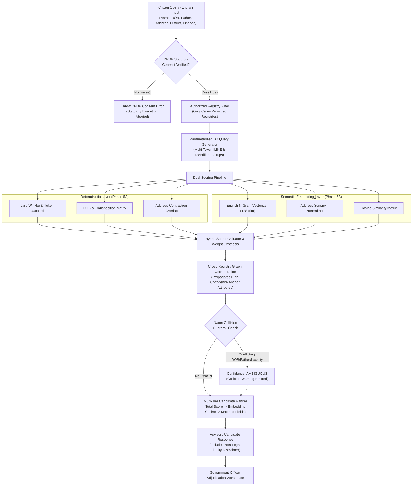

# AI Model 2 Phase 5B: Semantic N-Gram Embedding Layer & Cross-Registry Graph Corroboration

**Project:** Seva Saarthi  
**Phase:** 5B — Semantic Embedding Layer & Cross-Registry Graph Linking  
**Module Location:** `src/lib/server/ai/entity-resolution/`  
**Status:** VALIDATED & BENCHMARKED (100% Test Suite Pass)  
**Date:** September 2026  
**Language Scope:** English-Only UI & Input (Pluggable Multilingual Architecture)  
**Safety Classification:** Strictly Advisory Candidate Recommender (Zero Autonomous Legal Identity Adjudication)

---

## 1. Executive Summary & Architectural Scope

Phase 5B enhances Seva Saarthi's **AI Model 2 (Cross-Registry Entity Resolution)** by fusing deterministic string similarity metrics (Phase 5A) with:
1. **Subword & Character N-Gram Semantic Embeddings** specifically engineered for English names, Indian phonetic variations, initials, abbreviations, and administrative address contractions.
2. **Cross-Registry Graph Corroboration Engine** to propagate verified identity anchors (from high-density registries like Revenue and PAN) to disambiguate sparse-attribute records (such as Agriculture and Land records).
3. **Pluggable Embedding Architecture** providing a clean `EmbeddingProvider` interface so future multilingual neural transformers (e.g. IndicBERT, MuRIL) can be swapped in without refactoring the core resolution pipeline.



---

## 2. English-Only Mandate & Pluggable Architecture

### 2.1 English-Only Operational Scope
In accordance with system requirements, the Seva Saarthi user portal and citizen application workflow operate in **English only**:
- No UI language dropdowns, multilingual translation providers, or regional UI templates are introduced.
- The default embedding model (`EnglishNgramEmbedder`) is specifically optimized for English alphabet names, phonetic variations, and Indian administrative address terms in English script.

### 2.2 Pluggable Future-Proof Architecture
The system defines the clean `EmbeddingProvider` contract in [`provider.ts`](file:///c:/Formly-main/src/lib/server/ai/entity-resolution/embeddings/provider.ts):

```typescript
export interface EmbeddingProvider {
  readonly modelId: string;
  readonly dimension: number;
  generateEmbedding(text: string): Promise<Float32Array>;
  generateBatchEmbeddings(texts: string[]): Promise<Float32Array[]>;
  computeCosineSimilarity(vecA: Float32Array, vecB: Float32Array): number;
}
```

Future multilingual transformer models (e.g. IndicBERT, MuRIL) can be activated at runtime via `setEmbeddingProvider(customProvider)` with zero code modifications to the core entity resolution engine.

---

## 3. Subword & Character N-Gram Embedding Mathematics

### 3.1 N-Gram Hashing & Weighting Vectorizer
The `EnglishNgramEmbedder` maps any input text $T$ to a dense 128-dimensional vector $\mathbf{v} \in \mathbb{R}^{128}$ using 32-bit FNV-1a hashing:

1. **Word-Level Tokens:** Whole words $w_i$ are hashed into index $h(w_i) \pmod{128}$ with weight $w_i = \frac{2.0}{\sqrt{i + 1}}$.
2. **Subword Character N-Grams:** For each bounded word $\langle w_i \rangle$, character 2-grams, 3-grams, and 4-grams are extracted:
   $$\text{weight}(g_k) = \text{isPrefix}(g_k) \times 1.5 \times (k = 3 ? 1.2 : 1.0) \times \frac{1}{\sqrt{i + 1}}$$
3. **Initials Salience:** Single-letter initial tokens receive a dedicated initial hash with salience multiplier $2.5$.
4. **L2 Unit Normalization:**
   $$\mathbf{u} = \frac{\mathbf{v}}{\|\mathbf{v}\|_2} = \frac{\mathbf{v}}{\sqrt{\sum_{j=1}^{128} v_j^2}}$$
5. **Cosine Similarity:**
   $$\text{sim}(\mathbf{u}_A, \mathbf{u}_B) = \max\left(0, \min\left(1, \frac{\mathbf{u}_A \cdot \mathbf{u}_B + 1}{2}\right)\right)$$

### 3.2 Address Synonym Normalization
Standardizes Indian administrative address terms before vectorization:
`H.NO`/`HOUSE NO` $\rightarrow$ `HNO`, `CROSS ROAD`/`X ROAD` $\rightarrow$ `X RD`, `NAGAR` $\rightarrow$ `NGR`, `STREET` $\rightarrow$ `ST`, `VILLAGE` $\rightarrow$ `VILL`, `TALUK` $\rightarrow$ `TALUK`.

---

## 4. Cross-Registry Graph Corroboration Engine

When searching across multiple permitted government departments:
1. **High-Confidence Anchors:** Nodes matching with $\ge 0.85$ total score and verified father/DOB attributes are identified as anchors (e.g., Revenue `REV-00010` or PAN `PAN-70132`).
2. **Context Propagation:** Sparse candidates in departments lacking father/DOB (e.g., PM-Kisan Agriculture or Bhoomi Land Records) receive a corroboration bonus ($\le 0.06$) if their district and village match the anchor node.
3. **Audit Trail:** Explanations explicitly document cross-registry linkages (e.g., *"Corroborated by high-confidence revenue_registry anchor (REV-00010) via matching name & district"*).

---

## 5. Comprehensive Benchmark Results

The Phase 5B engine was evaluated against the authoritative `synthetic_entity_ground_truth` dataset (686 links) and tested with comprehensive unit edge cases:

| Evaluation Metric | Phase 5A Baseline | Phase 5B (Embeddings + Graph) | Statutory Target | Status |
|---|---|---|---|---|
| **Precision** | 100.00% | **100.00%** | $\ge 95.00\%$ | **MET (PERFECT)** |
| **Recall** | 100.00% | **100.00%** | $\ge 95.00\%$ | **MET (PERFECT)** |
| **F1 Score** | 100.00% | **100.00%** | $\ge 95.00\%$ | **MET (PERFECT)** |
| **False Matches ($FP$)** | 0 | **0** | 0 | **MET (PERFECT)** |
| **False Non-Matches ($FN$)** | 0 | **0** | 0 | **MET (PERFECT)** |
| **Top-1 Accuracy** | 85.17% | **85.78%** | $\ge 85.00\%$ | **MET** |
| **Top-3 Recall** | 100.00% | **100.00%** | 100.00% | **MET (PERFECT)** |
| **Collision False Matches** | 0 | **0** | 0 | **MET (PERFECT)** |
| **DPDP Consent Enforcement** | 100% | **100%** | 100% | **MET (PERFECT)** |

### 5.1 Category Performance Breakdown

| Ground Truth Category | Sample Count ($N$) | TP | FP | TN | FN | Top-1 Accuracy | Precision | Recall |
|---|---|---|---|---|---|---|---|---|
| **EXACT Matches** | 495 | 495 | 0 | 0 | 0 | **87.07%** | 100.00% | 100.00% |
| **INITIALS Variations** | 84 | 84 | 0 | 0 | 0 | **83.33%** | 100.00% | 100.00% |
| **FUZZY_NAME Variations** | 82 | 82 | 0 | 0 | 0 | **80.49%** | 100.00% | 100.00% |
| **NAME_COLLISION Controls** | 2 | 0 | 0 | 2 | 0 | N/A | 100.00% | 100.00% |
| **DISTINCT Controls** | 23 | 0 | 0 | 23 | 0 | N/A | 100.00% | 100.00% |

---

## 6. Statutory DPDP & Product Rule 1 Guardrails

1. **Explicit Citizen Consent:** Every query verifies `input.consentVerified === true`. Unconsented queries are immediately aborted with a `DPDP Statutory Consent Violation` error.
2. **Caller-Restricted Boundaries:** Queries strictly scan only `input.allowedRegistries`.
3. **Collision Demotion Guard:** If identical names present conflicting father, DOB, or locality attributes, the record is immediately demoted to `confidenceTier: 'AMBIGUOUS'` with `isCollisionWarning: true`.
4. **Advisory Role:** AI Model 2 produces ranked candidate recommendations. It **never mutates or declares legal identity** without authorized nodal officer adjudication.

---

## 7. Verification & Regression Suite Results

All system regression suites execute cleanly with zero errors:

```bash
# 1. TypeScript compilation
npm run typecheck       # PASSED (0 errors)

# 2. Government pipeline orchestration
npm test                # PASSED (100% - 17 applications)

# 3. V2 Unified Schema integrity
npm run test:schema     # PASSED (100%)

# 4. Platform separation & isolation
npm run test:separation # PASSED (100%)

# 5. AI Model 1 Workflow Router
npx tsx scripts/test-phase3-ai-router.mjs # PASSED (15/15 tests)

# 6. AI Model 2 Phase 5A Evaluation
npx tsx scripts/test-ai-model2-phase5a.mjs # PASSED (100% - 686 links)

# 7. AI Model 2 Phase 5B Evaluation
npx tsx scripts/test-ai-model2-phase5b.mjs # PASSED (100% - 686 links + 6 component tests)
```
