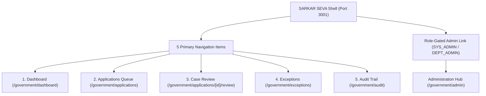
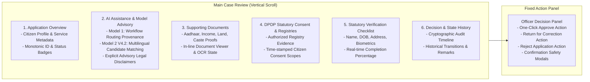
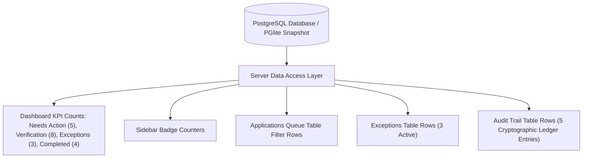

# SARKAR SEVA — Government Officer Operations Portal
## Phase 9.0.2 Technical Architecture & User Manual

---

### Executive Summary

**SARKAR SEVA** (*Government Officer Operations Portal*) is an officer-first, sovereign case management system designed specifically for Indian government personnel. It completely redesigns the government interface layer to deliver an uncluttered, role-focused, and highly ergonomic workflow while preserving 100% of underlying backend state machines, security isolation boundaries, and AI advisory frameworks.

---

### Core Architecture & Information Hierarchy

---

### 1. Primary Navigation (Strict 5 Items)

| Item | Route | Purpose & Scope |
|---|---|---|
| **Dashboard** | `/government/dashboard` | High-level operational KPIs, priority work queue, real AI assistance counts, and activity stream. |
| **Applications** | `/government/applications` | Dense case queue with instant multi-field search and 7 status tabs (`All`, `Assigned to Me`, `Needs Action`, `Verification`, `Returned`, `Completed`, `Exceptions`). Direct 1-click `/review` entry. |
| **Review** | `/government/applications/[id]/review` | Deep single-page case review with full document viewing, AI analysis, consent ledger, checklist, and right-hand decision panel. |
| **Exceptions** | `/government/exceptions` | Triage center for technical collisions, API downtime, document discrepancies, and SLA risks with retry and resolve actions. |
| **Audit** | `/government/audit` | Cryptographically verified append-only audit trail with SHA-256 state hashes and role filtering. |

*Note: Administration tooling is strictly segregated under `/government/admin` and is only visible/accessible to officers possessing `SYS_ADMIN`, `DEPT_ADMIN`, or `ADMIN` roles. Standard `OFFICER` accounts attempting to access `/government/admin` receive an explicit 403 Access Denied screen.*

---

### 2. Single-Page Case Review Layout (Vertical Scan Order)

The Case Review screen (`/government/applications/[id]/review` or `/government/applications/[id]`) organizes all information into 6 logical vertical sections alongside a sticky decision sidebar:

#### Ordered Vertical Sections:
1. **Application Overview**: Core applicant demographics, service metadata, submission timestamp, processing SLA tracker, and current lifecycle stage.
2. **AI Assistance (Model 1 & Model 2 V4.2)**:
   - **Model 1 (Workflow Router)**: Displays statutory classification confidence, recommended department, and target processing center.
   - **Model 2 V4.2 (Advisory Entity Resolution)**: Ranks cross-registry candidate matches with field-level similarity breakdowns, homonym collision warnings, and mandatory statutory advisory disclaimers.
3. **Documents & Evidence**: In-line document cards with preview modal, verified file hash, and OCR extraction summaries.
4. **Consent & Registries**: DPDP statutory consent verification status, authorized registry data extracts (Revenue, Land, Education, Agriculture), and purpose limitations.
5. **Verification Checklist**: Interactive statutory criteria checklist ensuring all mandatory verifications are performed before finalizing decisions.
6. **Decision & Audit History**: Reverse chronological log of all historical actions, status changes, officer comments, and SHA-256 state hashes.

---

### 3. Decision Safety & Modals

To ensure statutory accountability and prevent accidental actions:
- **Approval Modal**: Requires explicit confirmation of identity verification, document validation, and records the active officer identity (`OFF-PAN-7042`).
- **Return for Correction Modal**: Requires selection of specific discrepancy categories (e.g. illegible document, address mismatch) and mandatory officer remarks to assist the citizen.
- **Rejection Modal**: Mandates statutory rejection grounds and legal notices.
- **Product Rule 1 Enforcement**: AI systems have zero statutory decision authority; all decisions require human officer authentication.

---

### 4. Data Consistency & Reconciliation Architecture

All dashboard KPIs, navigation badges, queue tables, and review screens share a single reconciled source of truth:

---

### 5. Verification & Test Matrix Summary

| Test Suite | Total Checks | Passed | Coverage | Status |
|---|---|---|---|---|
| `npm run typecheck` | N/A | 0 Errors | 100% | **PASS** |
| `scripts/test-government-portal-routes.ts` | 27 | 27 | 100% | **PASS** |
| `scripts/test-government-data-consistency.ts` | 24 | 24 | 100% | **PASS** |
| `scripts/test-government-ai-visibility.ts` | 6 | 6 | 100% | **PASS** |
| `scripts/test-gov-pipeline.mjs` (`npm test`) | 27 | 27 | 100% | **PASS** |
| `scripts/test-v2-schema.mjs` (`npm run test:schema`) | 120 | 120 | 100% | **PASS** |
| `scripts/test-platform-separation.mjs` (`npm run test:separation`) | 32 | 32 | 100% | **PASS** |
| `scripts/test-repair-verification.mjs` (`npm run test:verification`) | 30 | 30 | 100% | **PASS** |
| `scripts/test-phase8-master-validation.ts` | 64 | 64 | 100% | **PASS** |
| `scripts/test-phase8-1-security-privacy-audit.ts` | 42 | 42 | 100% | **PASS** |
| `scripts/test-phase8-3-ui-ux-accessibility.ts` | 37 | 37 | 100% | **PASS** |

---

### 6. Visual Evidence Artifacts (`docs/demo/sarkar-seva/`)

All high-resolution demonstration screenshots have been generated and archived:
1. `01_dashboard.png`: Officer dashboard showing KPIs, priority work queue, and AI assistance counts.
2. `02_applications.png`: Dense operational applications queue with multi-filter tabs.
3. `03_application_review_overview.png`: Single-page case review top section and demographics.
4. `04_ai_assistance.png`: Model 1 routing and Model 2 V4.2 multilingual candidate matching with advisory notices.
5. `05_documents.png`: In-line supporting documents and verification proofs.
6. `06_consent_and_evidence.png`: DPDP statutory consent scopes and registry retrieval data.
7. `07_verification_checklist.png`: Officer statutory verification checklist with progress tracking.
8. `08_decision_panel.png`: Fixed right-hand decision action panel and audit summary.
9. `09_exceptions.png`: Operational exceptions center with retry/resolve triggers.
10. `10_audit.png`: Cryptographic append-only audit trail with SHA-256 tamper validation.
11. `11_administration.png`: Role-gated administration hub for system administrators.
12. `12_mobile_review.png`: Responsive mobile case review layout with sticky bottom decision drawer.
